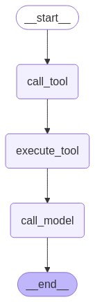

# CRUD Agent

An intelligent agent that can automatically perform CRUD operations on a database using a custom REST API via simple messaging.

---

## 🚀 Features

- **Natural Language Interface:** Chat with the agent to perform Create, Read, Update, and Delete operations on your database.
- **Automatic API Integration:** Connects to any REST API with an OpenAPI/Swagger specification.
- **LangGraph:** Modular, extensible agent logic for robust and explainable flows.
- **Streamlit Web UI:** Clean, interactive chat interface for seamless user experience.
- **Django REST Server:** Example project included for quick testing and demonstration.

---

## 🧠 Agent Flow

The following diagram illustrates the agent's reasoning and execution flow:



---

## 🛠️ Technologies Used
- **Agent Framework:** LangGraph
- **Web Interface:** Streamlit
- **LLM:** Mistral
- **REST API:** Django REST & Swagger 

---

## ⚡ Quickstart

1. **Clone the repository:**
   ```sh
   git clone https://github.com/Armaan457/CRUD-Agent.git
   ```

2. **Create and activate a virtual environment:**
   ```sh
   python -m venv env
   env\scripts\activate
   ```

3. **Install dependencies:**
   ```sh
   pip install -r requirements.txt
   ```

4. **Run the API server:**
   ```sh
   cd foods
   python manage.py runserver
   ```

5. **Run the app:**
   ```sh
   streamlit run app.py
   ```

---

## 💡 Example

For demonstration, REST APIs are provided for CRUD operations on a SQL database in the Django project `foods`.
